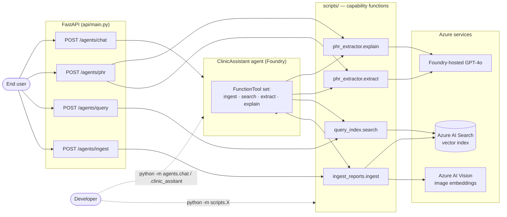

# Lab2PHR Architecture

Two personas, two paths to the same capability functions.

## Flows

**End user → REST (deterministic).**
`/ingest` vectorises an image via Azure AI Vision and writes it to the AI
Search index. `/query` runs vector k-NN against the same index. `/phr`
extracts a structured PHR JSON from a single image with GPT-4o, then asks the
model to explain it.

**End user → `/chat` (conversational).**
The request lands on the FastAPI endpoint, which forwards the message to the
`clinic-assistant` agent in Foundry. The agent decides which of the four
FunctionTools to invoke; `runs.create_and_process` executes the matching
Python function locally, submits the result back, and loops until the run
completes. Threads keep per-conversation memory.

**Developer.**
Skips both layers: runs the underlying scripts directly
(`python -m scripts.query_index`) for fast local verification, or talks to the
agent over the CLI/REPL (`python -m agents.clinic_assitant`,
`python -m agents.chat`) without going through HTTP.

## Why two paths

- REST endpoints are predictable and scriptable — good for pipelines and
  integration tests.
- The `/chat` agent path lets the model pick the tool — good for free-form
  user questions without writing routing code.
- Both call the *same* `scripts/` functions, so capability changes happen in
  one place.
