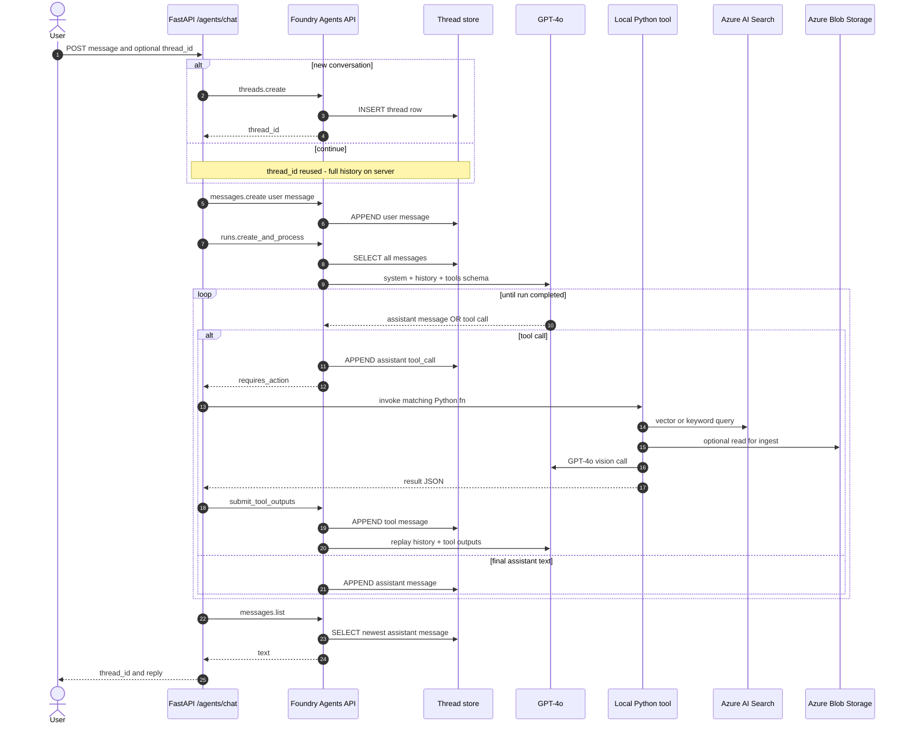
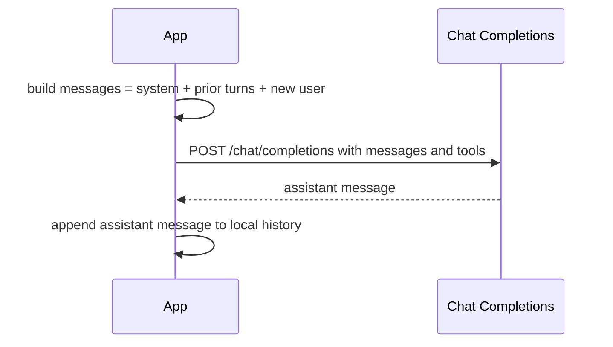
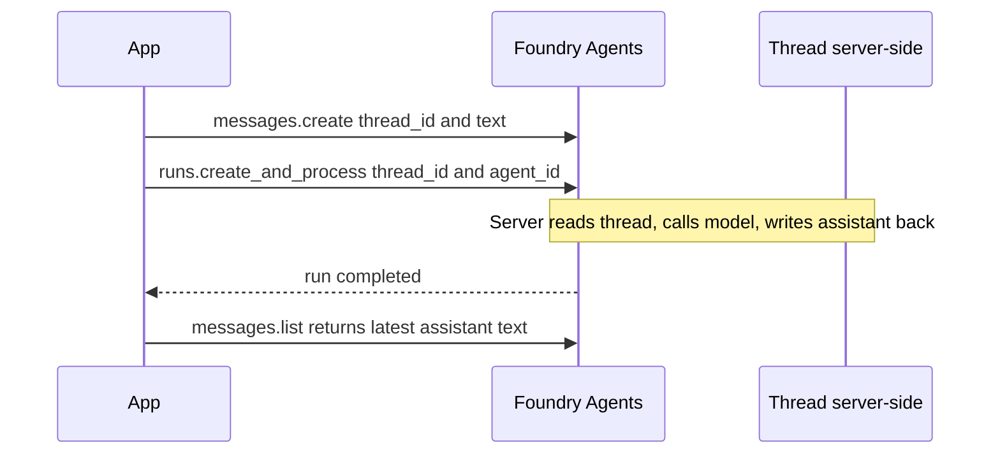
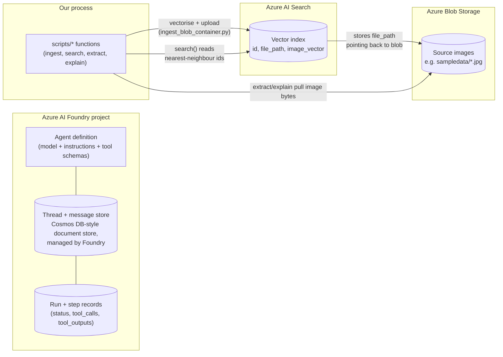
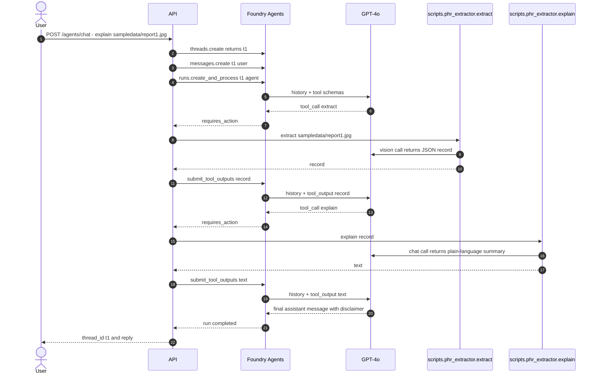

# Lab2PHR — Detailed Flow

Internals of the conversational path: how a thread is reused turn-after-turn,
how the agent loop drives tool calls, and where state lives.

---

## 1. Agent loop on a reused thread

The model is **stateless per call**. A "conversation" is just a thread on the
server side that we keep appending to and replaying.

### What "send the full context" means

Each iteration of the loop, Foundry rebuilds the prompt by reading every
message ever written to that `thread_id` (system instructions + every user,
assistant, and tool message). That blob is what gets sent to GPT-4o. The
client never has to re-send prior turns — passing `thread_id` is enough,
because the server already has them.

---

## 2. Two SDK shapes for "remembering the conversation"

### 2a. Chat Completions API (classic; what most providers expose)

- The server holds **no state**.
- The app must store every turn somewhere (DB, Redis, memory) and resend the
  whole array on every call.
- Token cost grows with history length unless the app trims/summarises.

### 2b. Responses API (newer; Foundry Agents threads work this way)

- The server holds the conversation. The client sends only `(thread_id,
  new_message)`.
- Agent definition (model + instructions + tools) is reused across users;
  threads provide isolation.
- Same `thread_id` in a later process resumes the exact same context — that
  is what `python -m agents.clinic_assitant --thread <id>` does.

---

## 3. Where state actually lives

### Concretely

- **Threads / messages / runs** are persisted by the Foundry Agents service.
  Microsoft hasn't published the underlying engine name; the externally
  observable behaviour is a Cosmos-DB-style document store keyed by
  `thread_id` and `run_id`. You don't manage it — visible in *AI Foundry
  portal → your project → Agents / Threads*.
- **AI Search index** stores the embedding (`image_vector`) plus a tiny
  payload (`id`, `file_path`). The vector lets us do k-NN; the `file_path`
  is a pointer back to the original blob.
- **Blob Storage** holds the source images. `scripts.ingest_blob_container`
  walks a container, generates the embedding via Azure AI Vision, and writes
  one Search doc per image. Later `extract` / `explain` can fetch the bytes
  again from blob (or work from a local path if running on the same machine).
- **Our app** holds nothing across requests — every Python process talks to
  the three Azure services above for state.

---

## 4. End-to-end — "explain sampledata/report1.jpg" on a fresh thread

A follow-up call with the same `thread_id` skips steps 2–3 and resumes from
the existing history — the model already "remembers" what the report said.
